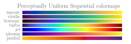
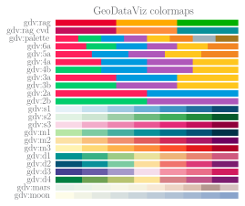

# Colormaps

This module defines some perceptually uniform sequential and several qualitative colormaps. All of them can be loaded into matplotlib by `prettypyplot.colors.load_cmaps` or simply using the setup function `prettypyplot.style.use_style`. With `prettypyplot.colors.load_colors` the colors of `pastel5` (`'pplt:blue'`, `'pplt:red'`, `'pplt:green'`, `'pplt:orange'`, `'pplt:lightblue'`), of two gray shades `'pplt:gray'` and `'pplt:lightgray'`, axes `'pplt:axes'`, grid `'pplt:grid'` and textcolor `'pplt:text'` can be accessed easily.

The qualitative colors `'pastel_autumn'`, `'pastel_spring'`, `'pastel_rainbow'` are neither  colorblind friendly nor suited for black-white.

!!! warning
    `macaw`, `pastel5`, `pastel6`, and `ufcd` will be only modified slightly in future relases. All others will probably change dramatically.

`viridis` and `jet` are only included here for comparsion. Both, `macaw` and `bownair` are modified versions of `viridis`. While `turbo` tries to be a better `jet` (see [here](https://ai.googleblog.com/2019/08/turbo-improved-rainbow-colormap-for.html)).

{: style="width: 100%"}
{: style="width: 100%"}

All colormaps starting with `tol:` were designed by Paul Tol. All of them are colorblind friendly and some are even print friendly. For a detailed discussion check out his lovely [blog](https://personal.sron.nl/~pault/).

{: style="width: 100%"}

And some beautiful taken from GeoDataViz. They should be all colorblind friendly. For more info please checkout [GeoDataViz](https://github.com/OrdnanceSurvey/GeoDataViz-Toolkit). The sequential colormaps with `s` are based on a single hue value, while `m` are multi-hue, and `d` are diverging.

{: style="width: 100%"}

For more colormaps see [matplolib colormaps](https://matplotlib.org/tutorials/colors/colormaps.html).
