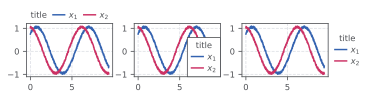
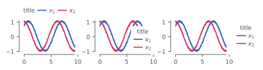
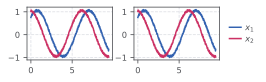
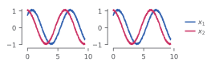

# Legend

This is an example of using [pplt.legend][prettypyplot.pyplot.legend].

!!! note
    If you want to disable the border for the default style you can simply rely on the matplotlib parameter and pass `frameon = False` to the method, for more parameters check out [matplotlib.pyplot.legend][].

{: style="width: 100%"}
{: style="width: 100%"}

```python
--8<--  "docs/gallery/legend.py:2:29"
```

## Deduplication across a 1×2 subplot grid

When the same series is plotted in multiple panels, passing `axs` collects all
handles and labels from every axis — and duplicate entries (same label **and**
same visual appearance) are removed automatically before the legend is drawn.

{: style="width: 100%"}
{: style="width: 100%"}

```python
--8<--  "docs/gallery/legend.py:33:47"
```

